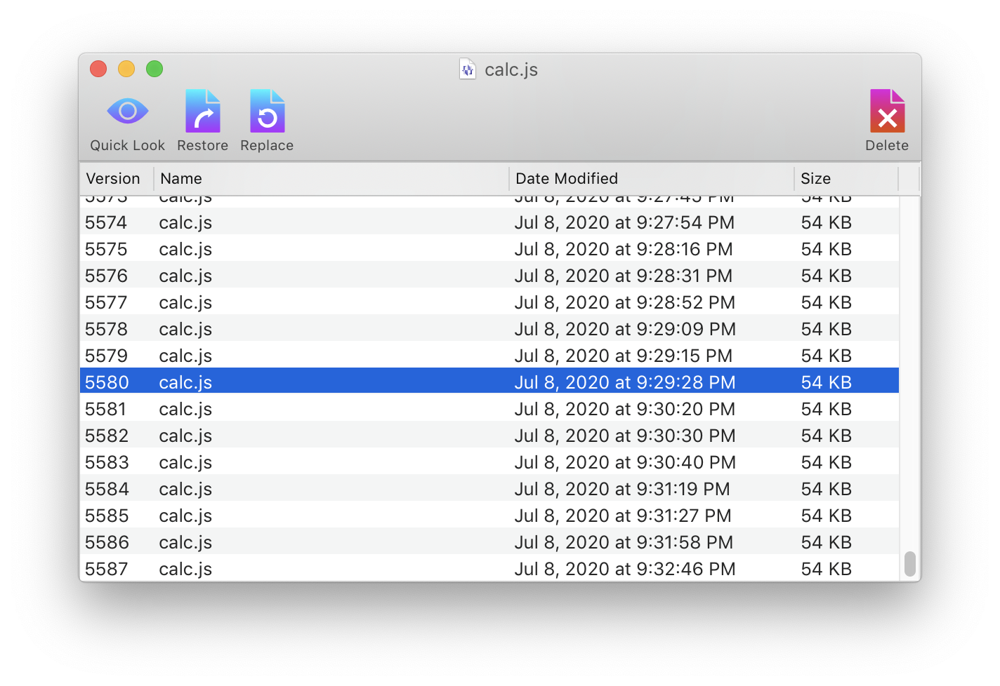

# restore

An application for accessing the file versioning system of Mac OS. Written in Objective-C. Requires Mac OS 10.12 (Sierra) or higher.

Mac OS has a built-in file versioning system called Versions, added in Lion. It transparently maintains previous versions of a file each time it is saved. The Versions interface is exposed in some applications (such as TextEdit) through the *File* → *Revert To* menu item. This application acts as a replacement for the full-screen Versions interface, which is slow and prevents multitasking.

## Releases

Binary versions are available on the [Releases](https://github.com/jcfieldsdev/restore/releases) page.

Binaries are self-signed but not notarized, so Mac OS 10.15 (Catalina) and higher display an error upon launching it. [Right-click the application icon and select "Open"](https://support.apple.com/guide/mac-help/open-an-app-by-overriding-security-settings-mh40617/mac) to enable the option to bypass this security warning.

## Acknowledgments

Uses [replay icon](https://www.flaticon.com/free-icon/replay_1142347) by [Freepik](https://www.freepik.com/) and [curve arrow icon](https://www.svgrepo.com/svg/17993/curve-arrow) and [pencil edit icon](https://www.svgrepo.com/svg/42233/pencil-edit-button) from [SVG Repo](https://www.svgrepo.com/).

## Authors

- J.C. Fields <jcfields@jcfields.dev>

## License

- [GNU General Public License, version 3](https://opensource.org/licenses/GPL-3.0)

## See also

- [Versions](https://github.com/jcfieldsdev/versions)—A command-line utility with the same basic functionality.
